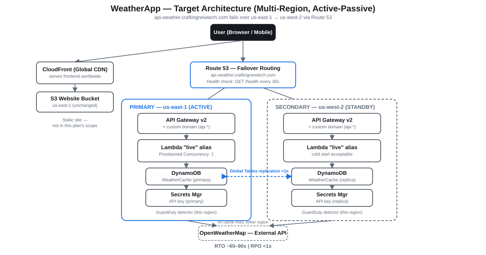

# Weather Dashboard

A production-quality, serverless weather application built entirely on AWS-managed services. Demonstrates modern Cloud and DevOps engineering practices including Infrastructure as Code, CI/CD automation, least-privilege security, and cost optimization — all within the AWS Free Tier.

**Live URL:** https://weather.craftingnewtech.com

---

## Architecture Overview

```
User → CloudFront (weather.craftingnewtech.com)
     → S3 (Static Website — HTML/CSS/JS)

User → Route 53 Failover (api.weather.craftingnewtech.com)
     → API Gateway HTTP API (us-east-1 primary / us-west-2 passive standby)
     → Lambda (Python 3.11)
     → SSM Parameter Store (API Key) / Secrets Manager (cross-region replica)
     → DynamoDB Global Tables (15-min Weather Cache, replicated)
     → OpenWeatherMap API (One Call 3.0)
```



All infrastructure is defined in CloudFormation. All deployments run through two independent CodePipelines (Infra + App — see `docs/WeatherApp-PipeSplit-ImplePlan-V1.md`). No manual steps after initial bootstrap. Automatic active-passive regional failover is documented in `docs/WAPMultiRegion/`.

---

## Technology Stack

| Layer               | Service                                       |
| ------------------- | --------------------------------------------- |
| Frontend hosting    | Amazon S3 + Amazon CloudFront                 |
| Custom domain + SSL | Route 53 + AWS Certificate Manager            |
| Backend compute     | AWS Lambda (Python 3.11)                      |
| API layer           | Amazon API Gateway HTTP API                   |
| Cache               | Amazon DynamoDB (On-Demand + TTL)             |
| Secrets             | AWS Systems Manager Parameter Store           |
| IaC                 | AWS CloudFormation (nested stacks)            |
| Source control      | AWS CodeCommit                                |
| CI/CD               | AWS CodePipeline + AWS CodeBuild              |
| Monitoring          | Amazon CloudWatch (Logs + Dashboard + Alarms) |
| External data       | OpenWeatherMap API (free tier)                |

---

## Features

- Real-time weather data for any city worldwide
- Current conditions: temperature, feels like, humidity, wind, pressure, visibility
- 7-day forecast (expandable daily cards) + 48-hour hourly strip per day
- Celsius / Fahrenheit toggle (client-side, no extra API call)
- 15-minute server-side cache (DynamoDB) — reduces API calls and cost
- Fully responsive — works on mobile and desktop
- HTTPS everywhere, API key never exposed to the browser
- Automatic regional failover (us-east-1 → us-west-2) if the primary region goes down

---

## Security Highlights

- API key stored in SSM Parameter Store (SecureString) — never in code or environment variables
- S3 bucket is private — CloudFront Origin Access Control (OAC) enforces access
- CORS restricted to `https://weather.craftingnewtech.com` only
- Input validated with a whitelist regex before any external call
- Least-privilege IAM — eight purpose-scoped roles, each with resource-level restrictions (see `docs/security.md`)
- Dependency CVE scanning (`pip-audit`) and IaC security scanning (`checkov`) in every pipeline run
- Unit tests with ≥ 80% coverage gate — failed tests block deployment

---

## Cost Estimate

Every core service still runs within the **AWS Free Tier** at portfolio traffic
levels. Two independent CodePipelines, two KMS CMKs, and the multi-region
failover rollout (a second GuardDuty detector, Secrets Manager replication,
a Route 53 health check) add real costs Free Tier doesn't cover.

**Current actual total: ~$21.39/month standard, ~$19.26/month with Free Tier
discounts** — see [docs/aws-WeatherApp-resources.md](docs/aws-WeatherApp-resources.md)
for the generated, per-resource-verified breakdown (95 resources across 10
categories). [docs/cost-optimization.md](docs/cost-optimization.md) explains
the design decisions behind minimizing it.

---

## Repository Structure

```
weather-dashboard/
├── frontend/                        # Static website (S3 + CloudFront)
│   ├── index.html
│   ├── css/styles.css
│   ├── js/
│   │   ├── app.js                   # Main application logic
│   │   └── config.js                # API endpoint config (no secrets)
│   └── assets/
├── backend/
│   ├── lambda/                      # Lambda function — modular Python
│   │   ├── weather_handler.py       # Entry point
│   │   ├── validators.py            # Input validation
│   │   ├── cache.py                 # DynamoDB cache
│   │   ├── weather_client.py        # OpenWeatherMap client
│   │   ├── secrets_manager.py       # Secrets Manager (API key)
│   │   └── requirements.txt         # Pinned dependencies
│   └── tests/                       # Unit tests (mocked AWS)
│       ├── test_weather_handler.py
│       ├── test_validators.py
│       ├── test_cache.py
│       ├── test_weather_client.py
│       └── test_secrets.py
├── infrastructure/
│   └── cloudformation/              # Modular CloudFormation nested stacks (15 templates)
│       ├── master.yml               # Root orchestrator (primary region)
│       ├── master-secondary.yml     # Secondary-region orchestrator (BackendStack + ApiStack only)
│       ├── 00-bootstrap.yml         # Artifacts bucket (created before the main stack)
│       ├── 01-iam.yml               # 8 purpose-scoped IAM roles
│       ├── 02-storage.yml           # S3 buckets
│       ├── 03-cdn.yml               # CloudFront + ACM + Route 53
│       ├── 04-database.yml          # DynamoDB
│       ├── 05-backend.yml           # Lambda
│       ├── 06-api.yml               # API Gateway + custom domain
│       ├── 07-ssm.yml               # SSM Parameter Store + Secrets Manager (cross-region replica)
│       ├── 08-pipeline.yml          # Infra pipeline: CodeCommit + CodeBuild + CodePipeline
│       ├── 08b-app-pipeline.yml     # App pipeline: Lambda/frontend/CDN deploys
│       ├── 09-monitoring.yml        # CloudWatch dashboard + alarms + Route 53 health-check alarm
│       ├── 11-audit.yml             # CloudTrail (multi-region trail)
│       └── 12-failover-dns.yml      # Route 53 health check + PRIMARY/SECONDARY failover records
├── pipeline/
│   └── scripts/
│       ├── validate-templates.sh    # cfn-lint + checkov (run locally or in CI)
│       ├── run-tests.sh             # pytest + coverage (run locally or in CI)
│       ├── deploy-infrastructure.sh # CloudFormation change set workflow
│       ├── invalidate-cloudfront.sh # CloudFront cache invalidation
│       └── validate-e2e.sh          # End-to-end validation (post-deploy)
├── diagrams/
│   ├── architecture.md              # AWS architecture (Mermaid)
│   ├── cicd-pipeline.md             # CI/CD pipeline flow (Mermaid)
│   ├── data-flow.md                 # Request lifecycle — cache hit/miss (Mermaid)
│   ├── iam-roles.md                 # IAM role map (Mermaid)
│   └── network-flow.md              # HTTPS / OAC / CORS boundary (Mermaid)
├── docs/
│   ├── deployment-guide.md          # Step-by-step bootstrap + update guide
│   ├── local-testing.md             # Pre-push local test procedure (frontend + backend + IaC)
│   ├── user-manual.md               # How to use the application
│   ├── api-documentation-v2.md      # Current API reference (supersedes api-documentation.md)
│   ├── security.md                  # Threat model and security controls
│   ├── cost-optimization.md         # Free-tier analysis and decisions
│   ├── troubleshooting.md           # Common issues and fixes
│   ├── bootstrap-issues.md          # First-deploy-only bootstrap gotchas
│   ├── WeatherApp-runbook.md        # Operational procedures
│   ├── WeatherApp-ProjectEvolution.md # Milestone-level project history (see CHANGELOG.md for line-by-line detail)
│   ├── architecture-decisions.md    # ADRs for every major choice
│   ├── aws-resources-data.yaml      # Source data for the generated resource inventory
│   ├── aws-WeatherApp-resources.md  # Generated resource inventory + cost breakdown
│   └── WAPMultiRegion/              # Multi-region failover plan, runbook, and drill procedure
├── buildspec.yml                    # CodeBuild build specification
├── pytest.ini                       # Test configuration
├── .coveragerc                      # Coverage configuration
├── ACTION_PLAN.md                   # Living project plan (updated each phase)
├── CHANGELOG.md                     # Version history
└── README.md                        # This file
```

---

## Prerequisites

| Tool      | Version | Purpose                           |
| --------- | ------- | --------------------------------- |
| AWS CLI   | v2.x    | Deploy and manage AWS resources   |
| Python    | 3.11+   | Run Lambda locally and unit tests |
| git       | 2.x+    | Source control with CodeCommit    |
| cfn-lint  | latest  | CloudFormation template linting   |
| checkov   | latest  | CloudFormation security scanning  |
| pip-audit | latest  | Python dependency CVE scanning    |

AWS account requirements:
- IAM user or role with permissions to create CloudFormation stacks, Lambda, S3, CloudFront, API Gateway, DynamoDB, SSM, CodeCommit, CodeBuild, CodePipeline, CloudWatch, Route 53, ACM
- OpenWeatherMap free API key — register at https://openweathermap.org/api

---

## Quickstart (Local Development)

```bash
# 1. Clone from CodeCommit after bootstrap (see docs/deployment-guide.md)
git clone https://git-codecommit.us-east-1.amazonaws.com/v1/repos/weather-dashboard

# 2. Install Python dependencies
pip install -r backend/lambda/requirements.txt
pip install pytest pytest-cov moto requests-mock

# 3. Run unit tests locally
bash pipeline/scripts/run-tests.sh

# 4. Validate CloudFormation templates locally
bash pipeline/scripts/validate-templates.sh

# 5. Serve the frontend locally (required — file:// skips CSP and hides CORS errors)
cd frontend && python3 -m http.server 8080
# Open http://localhost:8080 in your browser
```

See [docs/local-testing.md](docs/local-testing.md) for the full pre-push checklist.

---

## CI/CD Pipeline

Two independent CodePipelines, split by blast radius (see
`docs/WeatherApp-PipeSplit-ImplePlan-V1.md`). Every push to `main` in
CodeCommit is evaluated by a Lambda filter first, which inspects changed
paths and routes automatically — the engineer never manually chooses a
pipeline:

- **Docs-only commits** (`docs/`, `*.md`, `diagrams/*.md`) — **both pipelines skipped**.
- **`infrastructure/**` changed** — **Infra pipeline only**: Source → Validate (`cfn-lint`, `checkov`, AWS-side validate) → ApproveDeploy → Deploy (CloudFormation, us-east-1) → DeploySecondary (us-west-2, if configured) → ValidateDeployment.
- **`backend/**`/`frontend/**` changed** — **App pipeline only**: Source → Validate (`pip-audit`) → Test (`pytest`, ≥ 80% coverage) → ApproveDeploy → Deploy (Lambda canary + Provisioned Concurrency + frontend sync + CDN invalidation) → DeploySecondary (if configured) → ValidateDeployment.
- **Both changed in one commit** — Infra runs first; App is held until Infra's Deploy stage succeeds.

A failed gate stops that pipeline — nothing reaches production without passing every gate. `ApproveDeploy` is a manual approval step on both pipelines.

---

## Documentation

| Document                                                 | Description                                                                                      |
| -------------------------------------------------------- | ------------------------------------------------------------------------------------------------ |
| [Deployment Guide](docs/deployment-guide.md)             | Bootstrap and update instructions with exact CLI commands                                        |
| [Local Testing](docs/local-testing.md)                   | Pre-push checklist — frontend, unit tests, IaC validation                                        |
| [User Manual](docs/user-manual.md)                       | How to use the Weather Dashboard                                                                 |
| [API Documentation](docs/api-documentation-v2.md)        | Endpoint reference, parameters, response schema, error codes (supersedes `api-documentation.md`) |
| [Security](docs/security.md)                             | Threat model, controls, IAM design                                                               |
| [Cost Optimization](docs/cost-optimization.md)           | Free-tier analysis, cost at different traffic levels                                             |
| [Troubleshooting](docs/troubleshooting.md)               | Common issues and fixes                                                                          |
| [Bootstrap Issues](docs/bootstrap-issues.md)             | First-deploy-only gotchas (empty-bucket constraints, ACL defaults)                               |
| [Runbook](docs/WeatherApp-runbook.md)                    | Rotate API key, roll back, clear cache, tear down                                                |
| [Architecture Decisions](docs/architecture-decisions.md) | ADRs for every major technology choice                                                           |
| [Resource Inventory](docs/aws-WeatherApp-resources.md)   | Generated, per-resource cost breakdown (95 resources, 10 categories)                             |
| [Project Evolution](docs/WeatherApp-ProjectEvolution.md) | Milestone-level project history                                                                  |
| [Changelog](CHANGELOG.md)                                | Line-by-line technical changelog per release                                                     |
| [Multi-Region Failover](docs/WAPMultiRegion/)            | Active-passive failover plan, runbook, and live drill procedure                                  |

---

## Diagrams

| Diagram                                     | Description                            |
| ------------------------------------------- | -------------------------------------- |
| [Architecture](diagrams/architecture.md)    | Full AWS service architecture          |
| [CI/CD Pipeline](diagrams/cicd-pipeline.md) | CodeCommit → Production flow           |
| [Data Flow](diagrams/data-flow.md)          | Cache hit vs. cache miss request paths |
| [IAM Roles](diagrams/iam-roles.md)          | Role-to-service permission map         |
| [Network Flow](diagrams/network-flow.md)    | HTTPS, OAC, and CORS boundaries        |

---

## AWS Well-Architected Alignment

| Pillar                     | Implementation                                                                                                                                      |
| -------------------------- | --------------------------------------------------------------------------------------------------------------------------------------------------- |
| **Operational Excellence** | Full CI/CD pipeline, CloudWatch dashboards, structured logging                                                                                      |
| **Security**               | Least-privilege IAM, OAC, HTTPS, SSM secrets, input validation, CVE scanning                                                                        |
| **Reliability**            | Serverless (no single point of failure), DynamoDB Global Tables, automatic multi-region failover (us-east-1 → us-west-2) drilled live in production |
| **Performance Efficiency** | DynamoDB TTL cache, CloudFront CDN, Lambda cold start minimized                                                                                     |
| **Cost Optimization**      | Serverless, free-tier services, 15-min cache reduces external API calls                                                                             |
| **Sustainability**         | Scale-to-zero Lambda, no always-on servers                                                                                                          |

---

## License

MIT License — see [LICENSE](LICENSE) for details.

---

*Built with AWS CloudFormation, CodePipeline, Lambda, API Gateway, DynamoDB, CloudFront, and S3.*
*Powered by [OpenWeatherMap](https://openweathermap.org).*
